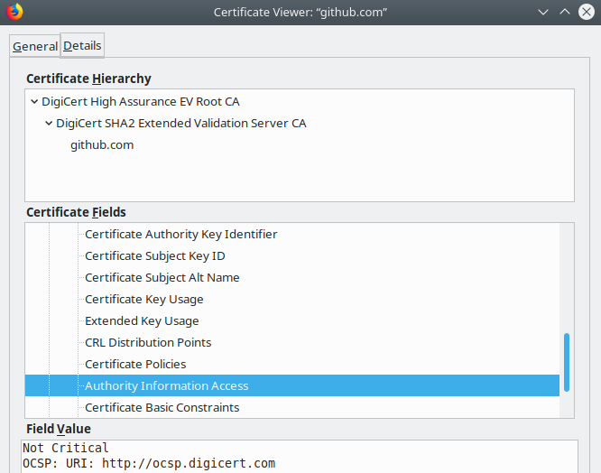

# Exercise B.3: Certificate Revocation

https://akshayranganath.github.io/OCSP-Validation-With-Openssl/

github.com: CRL + OCSP
letsencrypt.org: OCSP only

Apache doku check client Cert
https://httpd.apache.org/docs/current/mod/mod_ssl.html
SSLCARevocationCheck chain
SSLOCSPEnable leaf

## Objective

In this exercise you will learn about certificate revocation and how to check if a certificate (your communication partner is presenting) is revoked.

## Preface

Security of x.509 certificates relies on the private key being kept secret. Only authorized persons / systems are allowed to access it. If this is not guaranteed any more the certificate needs to be invalidated immediatelly. This is called __certificate revocation__ in x.509 context and needs to be done at least in the following situations:

   * The private key is stolen or suspected to be stolen.
   * An attacker had access (or suspected to have access) to the system storing the private key.

Depending on regulations in your organisation you might additionally need to revoke a certificate:

   * If the owning system is deprovisioned and the remaining validity period is exceeding a certain amount of time (e. g. more than 90 days remaining)
   * A colleague left the organisation who had access to the private key.

Only the Certifcate Authority (CA) which issued the certificate is able to revoke it.

## CRL versus OCSP

Everyone verifying certificates needs a method to check if the certificate has been revoked. Two different methods are currently used:

   * A __certificate revocation list__ (CRL) is one file containing information about every revoked certificate issued by this CA. It is digitaly signed by the CA, has a limited validity period and is distributed via a HTTP server.  
     See also: https://en.wikipedia.org/wiki/Certificate_revocation_list

   * With the __Online Certificate Status Protocol__ (OCSP) you can send a specific query to an OCSP reponder (provided by the CA) to check the revocation status of one single certificate. For the transfer also HTTP is used. The response is also digitaly signed by the CA and also has a limited livetime.  
     See also: https://en.wikipedia.org/wiki/Online_Certificate_Status_Protocol

## Revoke a Certificate

The concrete steps for revoking a certificate are a little different from CA to CA. Please see instructions provided by the Certificate Authority (CA) which issued the certificate.

## Check for Revocation

__IMPORTANT:__ For fully verifying a certificate presented to you by your communication partner, make sure you do not only check the validity of the certificate but also to check it for revocation. Your communication partner might be a server you are connecting to (presenting a server certificate) or - in mTLS usecase - also a client (authenticating by a client certificate).

Most Browsers nowadays do check revocation of server certificates by default. Other software components and libraries often (by default) don't. Make sure to configure a proper check! (You will do this in one example in a few moments.)

Each certificate contains the URL where the according CRL can be retrieved, or the URL of the according OCSP responder. Or if you are really lucky: Both (in this case you have the free choice on which to use).

Point your browser to https://github.com/ and examine the certificate. Probably it will contain both (at least for now - October 2019 - it does). A CRL URL:

 within the certificate")

And a OCSP URL:

## Steps

   * tbd

## Conclusion

tbd
