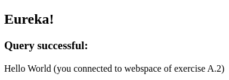
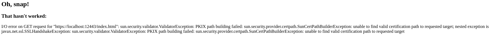

# TLS4Developers Workshop: Java Example For Exercise A2

## Short repetition: The concepts being taught in exercise A2

Exercise A2 of the workshop walks you through the steps of creating a 
private key, creating a new _Certificate Signing Request (CSR)_ based 
on that key, issuing a new self-signed certificate based 
on both the private key and the CSR, and finally launching an Apache 
web server making use of that new certificate. If the CSR was set up 
correctly -- i. e. the _Common Name_ attribute was set to `localhost` --, 
then you'll be able to connect securely to the web server, the only 
drawback in comparison to a certificate issued by an official 
_Certificate Authority (CA)_ being that a client has to explicitly trust
the self-signed certificate by placing it in its truststore.

The bottom line of exercise A2 is that self-signed certificates 
provide fully encrypted communication just as certificates signed by an 
official CA, but are not practical beyond development purposes because 
of the aforementioned drawback.

## What you'll learn in scope of this Java example
The goal of this Java example is to demonstrate how to establish secure 
connections to a web server backend that makes use of a self-signed 
certificate. As mentioned above, using a self-signed certificate does not 
impair encryption in any way, but entails the disadvantage that 
clients -- such as a Java client -- have to keep the self-signed 
certificate in their truststore in order to explicitly trust the 
certificate.

Because the given Java example is based on the Spring Boot 
framework, we can simply make use of the
`org.springframework.web.client.RestTemplate` class to serve as our 
client and establish secure connections to the HTTPS-enabled backend.

## Getting to work

### Prerequisites
The following steps assume you have successfully completed 
[exercise A2](https://github.com/booboo-at-gluga-de/TLS4Developers_Workshop/tree/master/exercises/A2)
of this workshop __including the last (third) of the optional steps__, 
that is, you have done the following:

* Created the three files _localhost.key_, _localhost.csr_, and _localhost.crt_
* Copied the _exercise-A2.conf_ file to _/etc/httpd/conf.d_ and edited 
the paths contained in there, if necessary
* Reloaded your Apache and verified there is now a TCP listener on port _12443_
* Created a key-less truststore from the _localhost.crt_ file and named it 
_localhost.truststore.p12_

As we'll need this truststore a bit further into the example, please make 
sure to copy it from the Vagrant box to your host system like so:

`$ scp -i <vagrant_box_key_file> vagrant@<vagrant_box_ip_address>:/home/vagrant/localhost.truststore.p12 .`

Both the location of the key file and the IP address can be listed using 
the following command:

`$ vagrant ssh-config`

### Establishing secure backend connections using a `RestTemplate`
If you've been using Spring Boot within a micro-service architecture -- 
not too wild a use case, as Spring Boot seems to be rather popular these days 
with micro-service aficionados, and rightfully so --, you may not have come across 
the necessity yet to make a `RestTemplate` -- or any other client-side 
object able to perform simple, HTTP-based operations against a remote 
backend, for that matter -- establish secure connections with such a backend. 
This is because in a micro-service architecture, you would normally 
have some HTTPS-terminating entity in front of your micro-services, 
so all communication between the latter is exchanged in plain HTTP. There 
is not much to be done for such use cases -- you may just auto-wire a
`RestTemplate` bean into your application context and get on with it. 
Things get a lot more interesting, however, if you actually *do* have 
to make secure connections.

In scope of this example, you can find the magic to create an 
HTTPS-enabled `RestTemplate` in class 
`de.tls4developers.examples.exercisea2.HttpsEnabledRestTemplateConfiguration`.
Our previously created truststore is made available here through the 
`http.client.ssl.trust-store` property, which is specified in the application's 
`application.properties` file -- by default, this property points 
to `classpath:truststore/localhost.truststore.p12`, so if you haven't changed 
either the location or the name of the truststore, you don't need to do 
anything here. But, as you'll recall from creating said truststore, there 
was a password that you had to set, and for the application to be able 
to use the truststore, that password has to be specified using the 
`http.client.ssl.trust-store-password` property, which you can also find 
in the `application.properties` file. The default password provided here 
will, of course, not work for your truststore, unless you have provided 
the exact same password while creating it.

After performing the above steps, your truststore should be located in 
_src/main/resources/truststore_ and it should be called _localhost.truststore.p12_ --
if it is called otherwise, make sure you've changed the `http.client.ssl.trust-store` 
property accordingly. Please also double-check the 
`http.client.ssl.trust-store-password` property is set correctly.

### Running the application and verifying expected behavior
Finally, after you've made sure everything has been set up correctly, you can 
run the application using the following command (from within the _exercise-a2_ 
directory, i. e. on the same directory level where this README is located):

`$ mvn spring-boot:run`

Once the application has started, open a browser and point it to 
_http://localhost:8080_ -- this will trigger a small piece of 
functionality in the application to attempt a call to 
_https://localhost:12443/index.html_, which will only be successful
if the truststore has been set up correctly in scope of exercise A2 
and has been provided to the application's `RestTemplate` 
(and, of course, the Apache within your Vagrant box has to be listening 
on that port). The expected behavior is that the browser displays the same 
message as when you run 
`$ curl --cacert localhost.crt https://localhost:12443/index.html`
from within your Vagrant box in the third line of the HTML output. So, if 
everything was set up correctly, your browser should look something like this: 

For comparison, here's what the result would look like had we not explicitly 
trusted the remote certificate by using the truststore in our `RestTemplate`:

 

 

